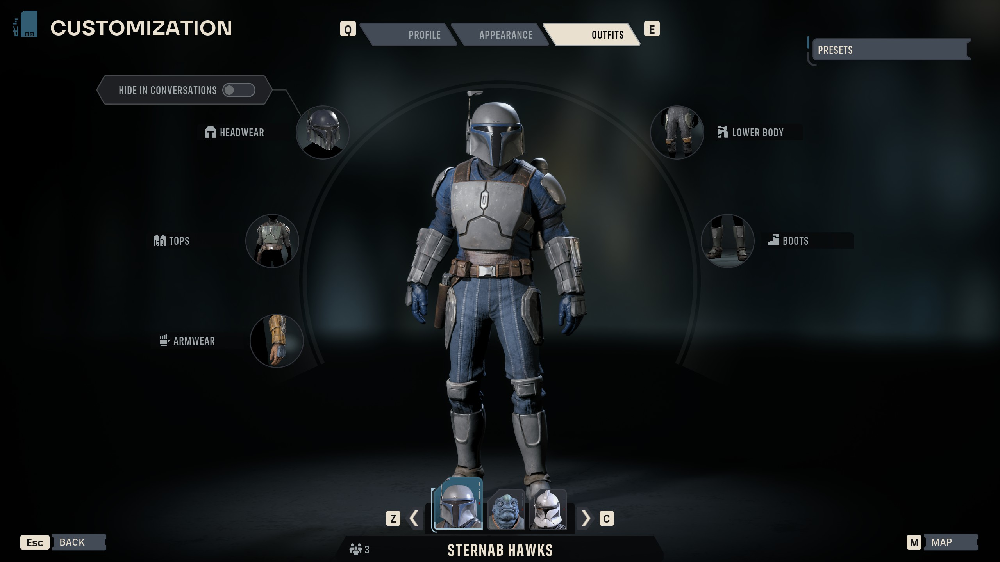

# Zero Company Mandalorian Wardrobe

Adds the Mandalorian Man001, Man002, and Cly armour sets already shipped with **Star Wars: Zero Company** to the normal colourable wardrobe for human characters.



## Features

- Sixteen ordinary colourable wardrobe choices across headwear, tops, armwear, lower body, and boots.
- Man001, Man002, and both Cly helmet variants.
- Authored backpacks remain linked to their armour instead of appearing as broken standalone tiles.
- Exact human-species gating; the mod does not globally unlock every authored or incompatible outfit.
- The game's original compatibility check still makes the final decision after the narrowly required Mandalorian/Cly tags are supplied.
- No console, keybind, networking, save editor, game asset, or co-op code.

## Requirements

- Windows Steam release of Star Wars: Zero Company, build `24874058`.
- [UE4SS for Star Wars Zero Company v1.0](https://www.nexusmods.com/starwarszerocompany/mods/9).

Yes, **UE4SS is required**. This is a native UE4SS C++ mod. Install the game-specific compatibility build above before installing the wardrobe. The compatibility package is not bundled here because its author does not permit re-uploading it.

The tested files are pinned to these hashes:

| File | SHA-256 |
|---|---|
| `SWZeroCompany.exe` | `C69131D496756EA421E408261FBA33B60613948E2C480ACAC91CB93632A4B67C` |
| compatibility `UE4SS.dll` | `8CB45C18230547A1EAD97BFEB34A2B5EF710B778890DDFC01877A7E9C61A07F4` |
| wardrobe `main.dll` | `10366CF4560450038D8030EDB31720C011670E1030ABB86F0C41DD1C06DEC879` |

The installer and DLL refuse an unrecognised executable or UE4SS build rather than guessing at native addresses.

## Installation

1. Close Zero Company completely.
2. Install [UE4SS for Star Wars Zero Company](https://www.nexusmods.com/starwarszerocompany/mods/9) into the game's `SWZeroCompany\Binaries\Win64` directory.
3. Download `ZeroCompanyMandoWardrobe-v0.3.0-build24874058.zip` from this repository's Releases page and extract it to a temporary folder.
4. From that extracted folder, run:

   ```powershell
   powershell -ExecutionPolicy Bypass -File ".\Install-Wardrobe.ps1" -Mode Enabled
   ```

The default game path is:

```text
C:\Program Files (x86)\Steam\steamapps\common\Star Wars Zero Company\SWZeroCompany\Binaries\Win64
```

For a different Steam library, supply the actual binary directory:

```powershell
powershell -ExecutionPolicy Bypass -File ".\Install-Wardrobe.ps1" -Mode Enabled -GameBin "D:\SteamLibrary\steamapps\common\Star Wars Zero Company\SWZeroCompany\Binaries\Win64"
```

The installer verifies all three hashes, preserves unrelated `mods.txt` entries and comments, creates a recoverable backup, copies only the wardrobe DLL, and enables:

```text
ZeroCompanyMandoWardrobe : 1
```

It does not install UE4SS or read or modify save files.

### Manual installation

If you do not want to run the helper script, copy:

```text
payload\ue4ss\Mods\ZeroCompanyMandoWardrobe
```

to:

```text
<Win64>\ue4ss\Mods\ZeroCompanyMandoWardrobe
```

Then add or update this line in `<Win64>\ue4ss\Mods\mods.txt`:

```text
ZeroCompanyMandoWardrobe : 1
```

Do not replace the entire `mods.txt`, because it may contain other installed mods.

## Using the wardrobe

Load the game normally and open the standard character customization wardrobe. The Mandalorian parts behave like regular wardrobe entries and use the normal per-slot colour controls.

The DLL logs either a `READY` line or a fail-closed `REFUSED` reason to `ue4ss\UE4SS.log` during startup.

## Disable or uninstall

Before disabling or removing the mod, equip a normal stock outfit and save. Loading a save while it still references mod-enabled Mandalorian parts without the mod present has not been fully tested.

Disable while retaining the DLL:

```powershell
powershell -ExecutionPolicy Bypass -File ".\Set-WardrobeEnabled.ps1" -State Disabled
```

The safe uninstall command disables the entry and keeps a recoverable copy:

```powershell
powershell -ExecutionPolicy Bypass -File ".\Uninstall-Wardrobe.ps1"
```

After equipping and saving a stock outfit, remove the installed folder into the backup location with:

```powershell
powershell -ExecutionPolicy Bypass -File ".\Uninstall-Wardrobe.ps1" -RemoveFiles -StockOutfitConfirmed
```

## Compatibility and limitations

- Version 0.3.0 supports only Steam build `24874058`. A game update will probably require a newly verified release.
- Some Man001/Man002 helmets can intersect particular faces. The Cly helmets fitted the tested masculine Hawk without visible clipping; other faces and bodies may vary.
- The catalogue logic is gated to the game's exact Human species tag, but every possible human character/body combination has not been visually checked.
- No achievement-disabling code or game-side mod gate was found. Achievements are expected to remain available, but a naturally earned achievement with this exact runtime setup has not yet been observed.

## Source and safety boundary

The complete mod source is in [`src/dllmain.cpp`](src/dllmain.cpp), with reproducible build instructions in [`docs/BUILDING.md`](docs/BUILDING.md).

The mod hooks only two exact game functions and validates the executable PE identity plus five exact 16-byte prologues before doing so. It modifies wardrobe catalogue results only for nineteen explicitly named shipped definitions: sixteen visible parts and three hidden backpack dependencies. It does not patch the game executable on disk or include extracted game assets.

## Licence and disclaimer

The original source and installer scripts are released under the [MIT License](LICENSE). See [third-party notices](THIRD_PARTY_NOTICES.md) for the libraries used by the release DLL.

This is an unofficial fan-made mod. It is not affiliated with or endorsed by Bit Reactor, Electronic Arts, Lucasfilm, Disney, Nexus Mods, or the UE4SS project. Star Wars and related marks and assets belong to their respective owners.
